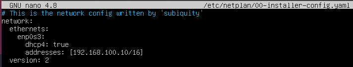
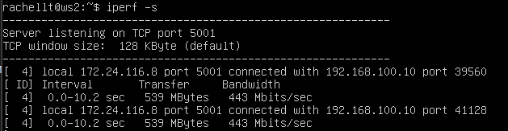
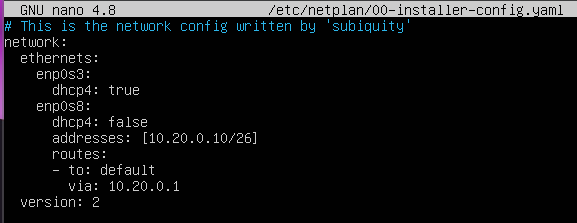
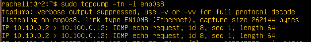

## Часть 1. Инструмент ipcalc ##
  ### 1.1.1 Сети и маски ###
  Адрес сети 192.167.38.54/13 <br>
   <br>
  ### 1.2.1 Перевод масок ###
  Перевод маски 255.255.255.0 в префиксную и двоичную запись <br>
   <br>
  /15 в обычную и двоичную <br>
   <br>
  11111111.11111111.11111111.11110000 в обычную и префиксную <br>
   <br>
  ### 1.3.1 Максимальный и минимальный хосты ###
  Минимальный и максимальный хост в сети 12.167.38.4 при маскe /8 <br>
   <br>
  При маскe 11111111.11111111.00000000.00000000 <br>
   <br>
  При маске 255.255.254.0 <br>
   <br>
  При маске /4 <br>
   <br>
  ### 1.2.1 localhost ###
  ```Зарезервированные адреса для localhost относятся к диапазону 127.0.0.0 с маской подсети /8``` <br>
  Исходя из этого:<br>
  194.34.23.100 - нельзя обратиться, адрес общедоступный <br>
  127.0.0.2 - можно обратиться, входит в диапазон <br>
  127.1.0.1 - можно обратиться, входит в диапазон<br>
  128.0.0.1 - нельзя обратиться, не входит в диапазон<br>
  ### 1.3.1 Диапазоны и сегменты сетей ###
  ```Диапазоны частных адресов:``` <br>
  ```10.0.0.0 - 10.255.255.255``` <br>
  ```172.16.0.0 - 172.31.255.255```<br>
  ```192.168.0.0 - 192.168.255.255```<br>
  Исходя из этого: <br>
  ```Частные:``` <br>
  - 172.20.250.4 <br>
  - 10.0.0.45 <br>
  - 192.168.4.2 <br>
  - 172.16.255.255 <br>
  - 10.10.10.10 <br>

  ```Публичные:```<br>
  - 134.43.0.2 
  - 172.0.2.1
  - 192.172.0.1
  - 172.68.0.2
  - 192.169.168.1
  ### 1.3.2 Возможные адреса шлюза IP адресов сети  10.10.0.0/18
  ```Диапазон сети 10.10.0.0/18: 10.10.0.1 - 10.10.63.254```<br>
  Возможны: 10.10.0.2, 10.10.10.10, 10.10.1.255 <br>
  Невозможны: 10.0.0.1, 10.10.100.1 <br>

## Часть 2. Статическая маршрутизация между двумя машинами ##
   <br>
   <br>
  Меняем конфиг: <br>
   <br>
   <br>
  Далее нужно изменить тип подключения на "Сетевой мост" и ребутнуть виртуалки. <br>
  ```sudo netplan apply``` <br>
   <br>
   <br>
  ### 2.1 Добавление статического маршрута вручную ###
   <br>
   <br>
   <br>
   <br>
  ### 2.2 Добавление статического маршрута с сохранением ###
  Меняем конфиг: <br>
   <br>
   <br>
  Пингуем: <br>
   <br>
   <br>

## Часть 3. Утилита iperf3 ##
  ### 3.1 Скорость соединения ###
   ```8Mbps = 8 / 8 = 1Mbs```<br>
   ```10Mbs = 8 * 1024 * 100 = 819200 Kbps```<br>
   ```1Gbps = 1 * 1024 = 1024Mbps```<br>
  ### 3.2. Утилита iperf3 ###
  Перевести виртуалки опять в NAT, проверить ping -c 2 8.8.8.8 и дальше  <br>
  ```sudo apt update```<br>
  ```sudo apt install iperf```<br>
  Ребутнуть виртуалки <br>
  На первой машине не работало после перевода в NAT, пришлось менять конфиг DNS:<br>
  ```sudo nano /etc/resolv.conf```<br>
  Изменить значение namserver на 8.8.8.8<br>
   <br>
   <br>

## Часть 4. Сетевой экран ##
  ### 4.1 Утилита iptables ###
  ```/etc/firewall.sh ws1``` <br>
   <br>
  ```/etc/firewall.sh ws1``` <br>
   <br>
  Запуск файлов: <br>
   <br>
   <br>
  Разница заключается в том, что на первой виртуалке у нас запрещающее правило стоит раньше разрешающего, на второй наоборот и следовательно первая виртуалка не будет пинговаться. <br>
   <br>
   <br>
   <br>

## Часть 5. Статическая маршрутизация сети ##
  ### Часть 5.1 Настройка адресов машин ###
  ```ws11config```<br>
   <br>
  ```ws21config``` <br>
   <br>
  ```ws22config``` <br>
   <br>
  ```r1config``` <br>
   <br>
  ```r2config``` <br>
   <br>
  ip -4 a для каждой машины: <br>
  ```ws11``` <br>
   <br>
  ```ws21``` <br>
   <br>
  ```ws22``` <br>
   <br>
  ```r1``` <br>
   <br>
  ```r2``` <br>
   <br>
  Пингуем r1 с ws11: <br>
   <br>
  Пингуем ws22 с ws21: <br>
   <br>
  ### 5.2 Включение переадресации IP-адресов ###
   <br>
   <br>
   <br>
   <br>
  ### 5.3 Установка маршрута по умолчанию ###
  ```ws11``` <br>
   <br>
  ```ws21``` <br>
   <br>
  ```ws22``` <br>
   <br>
  ```ws11 ip r``` <br>
   <br>
  ```ws21 ip r``` <br>
   <br>
  ```ws22 ip r```<br>
   <br>
  ```tcpdump``` <br>
   <br>
  ping r2 <br>
   <br>
  ### 5.4 Добавление статических маршрутов ###
   <br>
   <br>
   <br>
   <br>
   <br>
  Маршруты различаются, потому что при маршрутизации в первом случае маршрут задан явным образом в конфигурационном файле. <br>
  ### 5.5. Построение списка маршрутизаторов ###
   <br>
   <br>
  Traceroute предоставляет информацию о пути пакета данных из одной точки сети на конкретный IP-сервер. Когда данные передаются между двумя точками, они должны проходить через маршрутизаторы.
  Traceroute сопоставляет каждый переход, предоставляет подробную информацию и время приёма-передачи (RTT), а также, по возможности, сообщает имя устройства и IP-адрес. <br>
  ### 5.6. Использование протокола ICMP при маршрутизации ###
   <br>
   <br>

## Часть 6. Динамическая настройка IP с помощью DHCP ##
  dhcp conf r2 <br>
   <br>
  resolv.conf r2
   <br>
  restart dhcp <br>
   <br>
  ip a ws22 <br>
   <br>
  ws22 ping ws21 <br>
   <br>
  netplan macaddress add <br>
   <br>
  dhcp.conf r1 <br>
   <br>
  ```sudo restart isc-dhcp-server```
   <br>
  На ws 21: до обновления <br>
   <br>
  ```sudo dhclient enp0s8``` <br>
  На ws 21: после обновления <br>
   <br>

## Часть 7. NAT ##
  ```sudo apt install apache2``` <br>
  r1 /etc/apache2/ports.conf <br>
   <br>
  ws22 /etc/apache2/ports.conf <br>
   <br>
  r1 start apache <br>
   <br>
  ws22 start apache <br>
   <br>
  меняем firewall на r2: <br>
   <br>
  ping ws22 с r1: <br>
   <br>
  меняем фаервол: <br>
   <br>
  пинга идет <br>
   <br>
  добавил SNAT и DNAT <br>
   <br>
  telnet c ws22: <br>
   <br>
  telnet c r1: <br>
   <br>

## Часть 8. Знакомство с SSH tunnels ##
  запуск фаервола <br>
   <br>
   <br>
  запуск апачи: <br>
  ```sudo service apache2 start``` <br>
  local tcp: <br>
   <br>
   <br>
  remote tcp: <br>
   <br>
   <br>